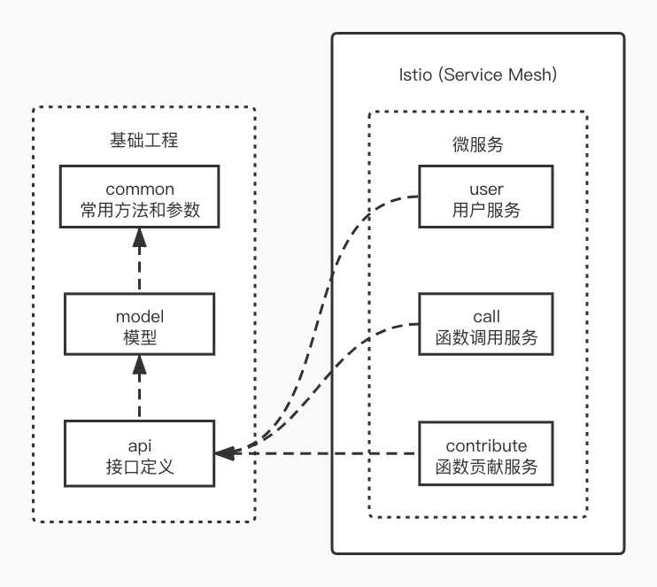

### Mathless

在 [原项目](https://github.com/mathless-tju/backend) 的基础上将各模块独立出来方便开发并配合 istio 使用

#### Istio 相关
kiali: http://192.168.1.6:30188

#### Mathless 相关

用户模块:

内网：http://192.168.1.6:32637/user

函数调用模块:

内网：http://192.168.1.6:32637/call

函数贡献模块:

内网：http://192.168.1.6:32637/contribute

